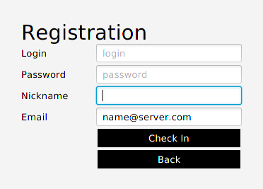
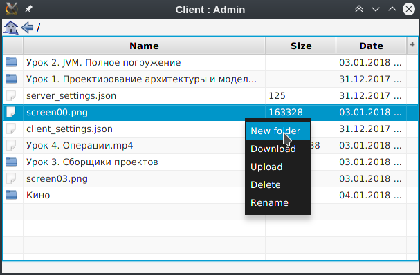
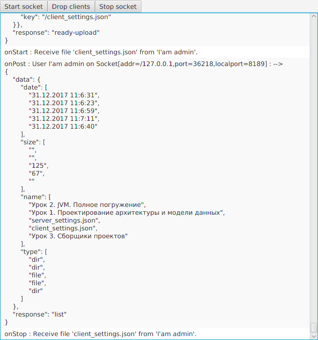

# Geek University Android 
## 2 семестр
## Java. Углубленное изучение
14 ноября 2017 MSK (UTC+3)

Курсовой проект:
- Модуль "Server" - серверная часть 
- Модуль "Client" - клиентская часть 
- Модуль "Common" - общие классы между клинтом и сервером

Проект работает на WebSocket (stateful). 

### Настрока серверной части:

##### Создать на MySQL-сервере схему jis.
Создать пользователя jis с паролем jis. Привязать схему jis к пользователю jis.
В схеме jis под пользователем root создать таблицу:

```sql
CREATE TABLE jis.Users
(
  id int(11) PRIMARY KEY NOT NULL AUTO_INCREMENT,
  login varchar(20) NOT NULL,
  password varchar(20) NOT NULL,
  nickname varchar(20) NOT NULL,
  email varchar(320) NOT NULL,
  uuid varchar(37) NOT NULL
);
CREATE UNIQUE INDEX Users_id_uindex ON jis.Users (id);
CREATE UNIQUE INDEX Users_login_uindex ON jis.Users (login);
CREATE UNIQUE INDEX Users_nickname_uindex ON jis.Users (nickname);
CREATE UNIQUE INDEX Users_email_uindex ON jis.Users (email);
CREATE UNIQUE INDEX Users_uuid_uindex ON jis.Users (uuid);
INSERT INTO jis.Users (id, login, password, nickname, email, uuid) VALUES (1, 'admin', 'admin', 'Admin', 'gDavidLevy@gmail.com', '1000');
```

##### Файл настроек "server_settings.json":
```json
{
  "server": {
    "hostname": "127.0.0.1",
    "backlog": 100,
    "port": 8189,
    "storage_folder": "/store/david"  
  }
}
```
**"storage_folder"** - каталог хранения файлов пользователя

**"hostname"** - имя хоста сервера доступное в сети Интернет

**"port"** - порт

**"backlog"** - максимальное количество подключений к соккет-серверу 

Если файл "server_settings.json" отсутствует, то он создается автоматически с настройками по умолчанию.

##### Параметры запуска серверного приложения.

Установить "VM options": --add-modules=java.xml.bind --illegal-access=warn

##### После запуска серверного приложения, нажать на кнопку "Start socket". 
Поле этого клиенту смогут подключаться и регистрироваться.

### Настрока клиентской части:

##### Файл настроек "сlient_settings.json":
```json
{
  "client": {
    "hostname": "127.0.0.1",
    "port": 8189
  }
}
```
**"hostname"** - имя хоста сервера доступное в сети Интернет

**"port"** - порт

Если файл "сlient_settings.json" отсутствует, то он создается автоматически с настройками по умолчанию.

### Логин и пароль:
По умолчанию логин: **admin**, пароль: **admin**.

### Скриншоты:

Структура:


Клиент:






Сервер:



